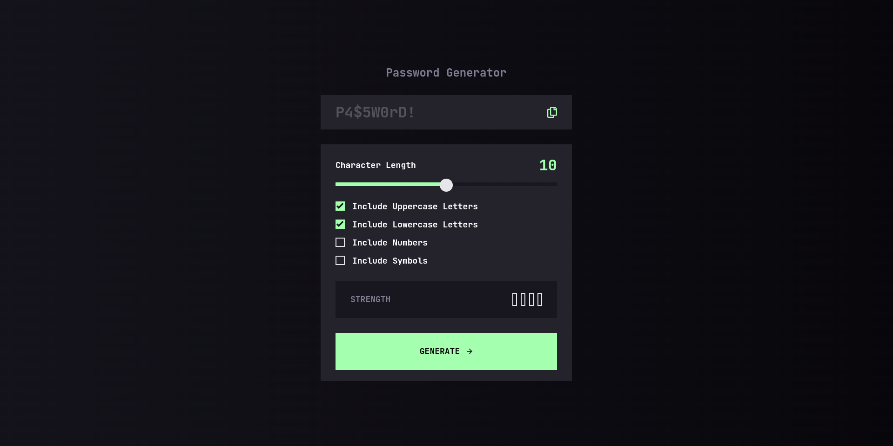

# Frontend Mentor - Password generator app solution

This is a solution to the [Password generator app challenge on Frontend Mentor](https://www.frontendmentor.io/challenges/password-generator-app-Mr8CLycqjh). Frontend Mentor challenges help you improve your coding skills by building realistic projects.

## Table of contents

- [Overview](#overview)
  - [The challenge](#the-challenge)
  - [Screenshot](#screenshot)
  - [Links](#links)
- [My process](#my-process)
  - [Built with](#built-with)
  - [What I learned](#what-i-learned)
- [Author](#author)
- [Acknowledgments](#acknowledgments)

## Overview

### The challenge

Users should be able to:

- Generate a password based on the selected inclusion options
- Copy the generated password to the computer's clipboard
- See a strength rating for their generated password
- View the optimal layout for the interface depending on their device's screen size
- See hover and focus states for all interactive elements on the page

### Screenshot



### Links

- Solution URL: [https://github.com/async-kita/password-generate-app](https://github.com/async-kita/password-generate-app)
- Live Site URL: [https://async-kita.github.io/password-generate-app/](https://async-kita.github.io/password-generate-app/)

## My process

### Built with

- Semantic HTML5 markup
- CSS custom properties (variables)
- Flexbox & CSS Grid
- Mobile-first workflow
- Vanilla JavaScript (ES6+)
- Web Crypto API (`crypto.getRandomValues`)
- Clipboard API
- ARIA accessibility attributes

### What I learned

Building this password generator helped me reinforce several key skills:

- **Cryptographically secure random generation** – using `window.crypto.getRandomValues` instead of `Math.random()` for better security.
- **Custom range input styling** – dynamically updating a CSS `--value` custom property to show a live progress gradient.
- **Password strength estimation** – based on length and the number of character types used (uppercase, lowercase, numbers, symbols).
- **Accessibility enhancements** – using `role="meter"`, `aria-live`, `aria-valuenow`, and proper labelling to make the generator usable by screen readers.
- **Clipboard API** – copying the generated password asynchronously with a temporary success message.

Example of the range progress update:

```js
updateRangeProgress = () => {
  const percent = ((value - min) / (max - min)) * 100;
  this.rangeElement.style.setProperty("--value", `${percent}%`);
};
```

Example of the password generation loop with cryptographic randomness:

```js
const randomValues = new Uint32Array(length);
window.crypto.getRandomValues(randomValues);
for (let i = 0; i < length; i++) {
  const randomIndex = randomValues[i] % availableChars.length;
  password += availableChars[randomIndex];
}
```

## Author

- Website - [GitHib](https://github.com/async-kita)
- Frontend Mentor - [@async-kita](https://www.frontendmentor.io/profile/async-kita)

## Acknowledgments

Thanks to Frontend Mentor for providing the design and challenge. Also a shout‑out to the open‑source community for the many articles on custom range inputs and cryptographic randomness in JavaScript.
